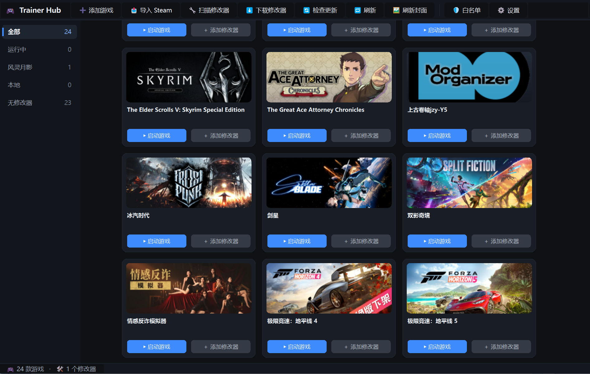

# Trainer Hub

> 简体中文版见 [README_zh.md](README_zh.md) · English below

**Trainer Hub** is a portable Windows desktop tool that manages single-player game trainers in one place:

**register → search → one-click launch → auto-detect running games → download from the official site.**

Built with Python 3.10 + PySide6.



## Features

| Feature | Description |
| --- | --- |
| Game library | Card wall (Steam covers), search, filter by source (Fling / Local / No trainer) |
| Import games | Auto-parses desktop `.url`/`.lnk` shortcuts **in parallel**; Steam games auto-fetch Chinese name + cover |
| Launch | One-click launch of games and trainers (admin elevation, UAC prompt is normal), combined game+trainer launch |
| Running detection | Cards highlight "running" while the game process is alive |
| Scan trainers | Scan any folder, auto-identify trainers by keywords (Fling/Trainer/…), add to library |
| Official download | Built-in FlingTrainer adapter: search → download → auto-extract → add to library (best-effort) |
| Update check | Check the official site for new versions of downloaded trainers (Chinese names supported); removes the old file after updating |
| Refresh | One-click refresh: re-detect running states, prune missing trainer records, regenerate / retry covers |
| Offline covers | Auto-generate exe-icon / initials covers when no official cover is available (works offline) |
| Theme | Dark / light themes, switch instantly in Settings |
| Defender whitelist | One-click add the trainers directory to Windows Defender exclusions |

## Quick Start

**Option A — Source (portable)**
1. Double-click `启动.bat` — first run creates a virtual env and installs dependencies automatically.
2. Trainer Hub scans Steam shortcuts in the desktop `game` folder on first launch (parallel; several dozen import within seconds).
3. Add trainers (manual / folder scan / official download), then launch.

> First launch: initialization (cleanup + offline cover generation) runs in the background so the window stays responsive.

**Option B — Green build (no Python required)**
- Download `TrainerHub-<version>-green.zip` from the **GitHub Releases** page (attached on each release); unzip and run `TrainerHub.exe`.
- Data (library, covers, trainers) is created next to the exe and travels with the folder.
- Build it yourself (after code changes): `.\venv\Scripts\python -m PyInstaller --noconfirm --clean TrainerHub.spec`

## Safety

- **First-run confirmation**: trainers downloaded from the official site require a one-click confirmation (with SHA-256 shown) before first launch; local trainers are unaffected.
- **Download whitelist**: only `flingtrainer.com` (HTTPS) is allowed; every download is hashed with SHA-256 for the record.
- **Zip-slip protection**: archive entries with `../`, absolute paths, etc. are rejected.
- **No telemetry, no auto-update**: no data collection; only local audit logs of download/launch events are written.
- Antivirus false positives are normal for memory-modification tools; whitelist the `trainers` folder and **only download trainers from the official source**.

## Disclaimer

- This tool is intended for **single-player games only**.
- It only registers, launches and downloads trainers from official sources; it contains **no cracking or injection code**.
- THE SOFTWARE IS PROVIDED "AS IS", WITHOUT WARRANTY OF ANY KIND — see the [LICENSE](LICENSE) for details.

## Development

```bash
python -m venv .venv
.venv\Scripts\pip install -r requirements.txt
.venv\Scripts\python main.py
```

## Changelog

**v1.1.0**
- New: **light theme** (dark stays the default) — switch in Settings.
- Fixes & polish: faster first launch (cleanup + offline covers moved to background threads), faster shortcut import (parallel), update check (Chinese-name matching, removes old file after updating), refresh button prunes missing trainer records, cover refresh & stale-cover cleanup.

**v1.0.0**
- Initial release: game library, shortcut import, trainer management, launch & running detection, official download, covers (Steam / Epic / offline exe-icon), Defender whitelist.

## License

[MIT](LICENSE) © 2026 2asz