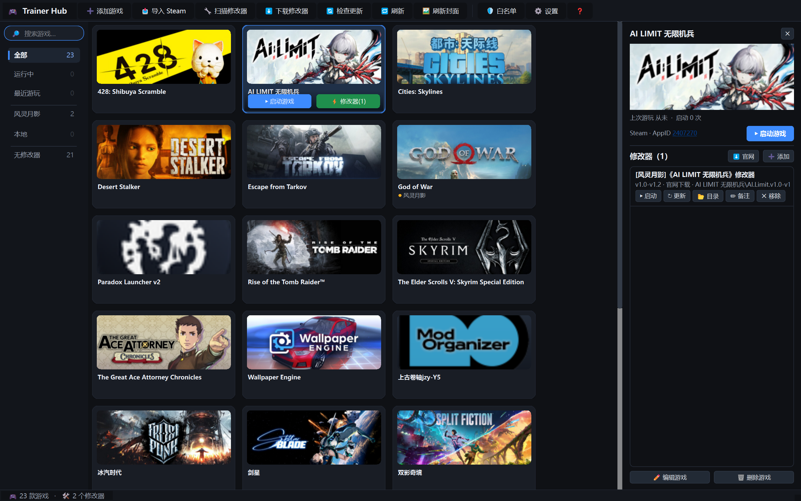

# Trainer Hub

> 简体中文版见 [README_zh.md](README_zh.md)


**Trainer Hub** is a portable Windows desktop tool that manages single-player game trainers in one place:

**register → search → one-click launch → auto-detect running games → download from the official site → stay up to date.**

Built with Python 3.10 + PySide6.



## ✨ Features

### Game library
- **Card wall** with official Steam covers; each cover shows a play badge (e.g. "1 day ago · 1 run")
- **Smart search**: game name / full pinyin (`saierda` → 塞尔达) / pinyin initials / typo tolerance (`cyperpank` still matches Cyberpunk)
- **Categories**: All / Running / Recently played / by source (Fling / Local) / No trainer, with live counters in the sidebar
- **Multiple ways to import**: **one-click import of every installed Steam game** (reads the local app manifest — no shortcuts needed), auto-scan desktop shortcuts (`.url`/`.lnk`, **parallel**), drag & drop `.exe`/`.lnk`/`.url` onto the window, or add manually
- **Play history**: every successful launch records time & count; "Recently played" sorts by recency

### Detail panel (slides in on single click)
- Large cover, play stats (last played / total launches), launch method
- **Complete trainer list**: version / path / source at a glance, each trainer with its own
  ▶ launch, ↻ check update, 📂 open folder, ✕ remove
- Official-site download (pre-selected game), add a local trainer, edit / delete the game — all inside the panel

### Launch & running detection
- One-click launch for games (Steam / Epic / local) and trainers (admin elevation; the UAC prompt is normal)
- Process detection via Windows **Toolhelp snapshots** (~5ms per round; the old psutil approach took 680ms)
- Cards highlight "running" while the game process is alive; optional "auto-start trainer with game"
- New processes are auto-learned after launching a Steam/Epic game (only inside the install directory, to avoid false positives)

### Download & updates
- **Official download** (FlingTrainer): search → **pick any version** (all releases parsed) → download → auto-extract into the library
- **Update check**: silent check at startup, clickable status-bar hint + orange badge on cards, update all at once, old file cleaned up automatically
- Resumable downloads with server-offset verification (no corrupted stitched files)

### Covers
- Official covers fetched from Steam / Epic; local games get their **exe icon** scaled edge-to-edge
- Initial-letter colored covers as the last resort (hue hashed from the name — stable across restarts)
- Failed downloads retry automatically with exponential backoff; "Refresh covers" retries everything at once

### Experience
- **Dark / light themes**, instant switch in Settings
- Custom-drawn card buttons with hover / pressed feedback
- **Data safety**: atomic library writes (fsync, power-loss safe) + rotating backups (5 kept);
  a corrupt library file is quarantined and **restored from backups automatically** (with a clear notice — never silently wiped);
  uninstalled games / deleted trainers / stale cover references are cleaned up at startup
- Portable: no registry writes, all data travels with the folder — delete the folder to uninstall

## ⌨️ Keyboard

| Key | Action |
| --- | --- |
| `Ctrl+F` | Focus search (`Esc` clears/blurs) |
| `↑` `↓` `←` `→` | Move selection across cards (updates the detail panel) |
| `Enter` | Launch the selected game |
| `Ctrl+Enter` | Launch the selected game's trainer |
| `Delete` | Remove the selected game (with confirmation) |

## 🚀 Quick Start

**Option A — from source**
1. Install [Python 3.10+](https://www.python.org/downloads/) (check `Add python.exe to PATH`)
2. Double-click `启动.bat` — first run creates a virtual env and installs dependencies automatically (~1-3 min, once)
3. On first launch the app imports Steam shortcuts from the desktop `game` folder (parallel; dozens within seconds)

**Option B — green build (no Python required)**
- Download `TrainerHub-<version>-green.zip` from **GitHub Releases**, unzip, run `TrainerHub.exe`
- Data (library, covers, trainers) is created next to the exe and travels with the folder
- Build it yourself: `.\venv\Scripts\python -m PyInstaller --noconfirm --clean TrainerHub.spec`

## 🔒 Safety & privacy

- **First-run confirmation**: trainers downloaded from the official site require a one-click confirmation (SHA-256 shown) before first launch
- **Download whitelist**: only `flingtrainer.com` over HTTPS; redirects to other domains are rejected; all requests go through private-IP checks (SSRF protection)
- **Archive protection**: zip-slip entries (`../`, absolute paths, device names, NTFS streams) rejected; 64MB per entry / 512MB total / 2000 entries caps; duplicate entries are renamed, never overwritten
- **Download integrity**: resume verifies the server's start offset, otherwise the partial file is discarded
- **No telemetry, no auto-update**: no data collection; only local audit logs (`data/audit.log`)
- Antivirus false positives are normal for memory-modification tools — whitelist the `trainers` folder (one-click in the app) and **only download trainers from the official source**

## ⚠️ Disclaimer

- Intended for **single-player games only**
- The app only registers / launches / downloads trainers from official sources; it contains **no cracking or injection code**
- Provided "AS IS", without warranty — see [LICENSE](LICENSE)

## 🛠 Development

```bash
python -m venv .venv
.venv\Scripts\pip install -r requirements.txt
.venv\Scripts\python main.py
```

- Stack: Python 3.10 + PySide6; data lives in `data/library.json` (UTF-8, atomic writes + debounced saves)

## 📜 Changelog

**v1.3.1**
- Fixed: 100+ issues from two full self-reviews — covers occasionally not showing, scan state stuck after cancel, "half-applied" library imports (now roll back cleanly), search box unusable in narrow windows, and more
- UI: search box moved to the sidebar (Ctrl+F works at any window width); card buttons now appear on hover (one more row per screen); play stats and the "recently played" order update instantly after launching a game; clickable AppID opening the Steam store page; shortcut cheat-sheet in the toolbar
- Hardened: bad data blocked before it reaches the library, faster batch cover fetching

**v1.3.0**
- New: **one-click full Steam import** — reads the local Steam app manifest (`appmanifest_*.acf`) and imports every installed game, no shortcuts required; localized names & covers are fetched from the official API afterwards
- New: **self-healing library** — a corrupt library file is no longer wiped: the bad file is quarantined, data is restored from the newest rotating backup automatically (with a clear notification); saves are fsync'd for power-loss safety; an empty library never overwrites good backups
- Hardened: another full code-review pass, 30+ fixes — streamed archive extraction (zip-bomb safe, caps enforced while reading), cached install-dir resolution (process watcher no longer re-reads registry/VDF/ACF every 2s), snapshot-based library reads, window-close thread race defenses, download concurrency cap that actually works, unified Defender whitelist (no more silent failures), staged "import library" that only commits on Save
- Internal: dialogs split into a package, further modularization; six automated regression suites (including power-loss corruption tests), static checks kept at zero warnings

**v1.2.0**
- New: **detail panel** — large cover / play stats / launch method / full trainer list (launch / update / folder / remove), replacing the old management dialog
- New: play history (recently-played category + cover badges); pinyin & fuzzy search; drag & drop import; keyboard flow (Enter / Ctrl+Enter / Delete)
- New: pick any version in the download dialog + copy direct link; per-trainer update check in the panel
- Hardened: two rounds of deep code review, 30+ fixes — cover cache three-state & retry race, task generation guard against stale results, cancel-means-nothing-changed dialog semantics, resume integrity checks, archive total-size caps & unique renaming, Steam API unified behind the SSRF whitelist, download concurrency slot leak, and more
- Performance: process detection rewritten (psutil 680ms → Toolhelp ~5ms), parallel import, fully backgrounded startup, stable initial-cover colors

**v1.1.0**
- New: light theme (dark stays the default), instant switch in Settings
- Faster: first launch (cleanup + offline covers backgrounded), parallel shortcut import, update-check matching, old-file cleanup

**v1.0.0**
- Initial release: game library, shortcut import, trainer management, launch & running detection, official download, covers (Steam / Epic / offline exe-icon), Defender whitelist

## License

[MIT](LICENSE) © 2026 2asz
