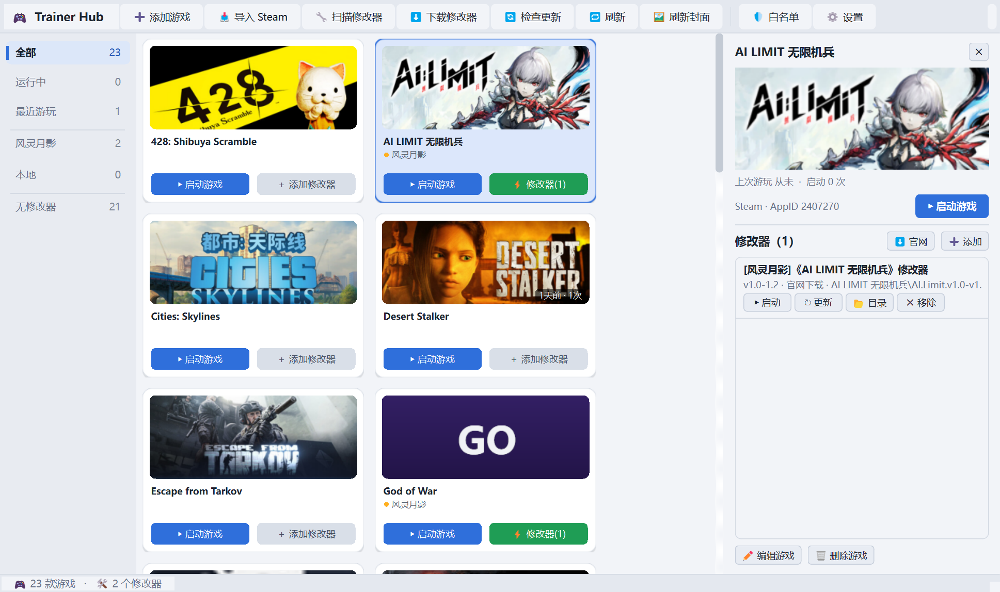

# Trainer Hub · 修改器整合

> English version: [README.md](README.md)


把风灵月影、本地修改器统一管理的绿色版 Windows 桌面工具：
**登记 → 搜索 → 一键启动 → 自动检测游戏 → 官网下载 → 检查更新**。



## ✨ 功能特性

### 游戏库
- **卡片墙**：Steam 高清封面展示，封面右下角显示游玩角标（如「1天前 · 1次」）
- **智能搜索**：支持游戏名 / 拼音全拼（`saierda` → 塞尔达）/ 拼音首字母 / 拼写容错（`cyperpank` 也能中）
- **分类筛选**：全部 / 运行中 / 最近游玩 / 按来源（风灵月影 / 本地）/ 无修改器，侧边栏实时计数
- **多种导入**：自动扫描桌面快捷方式（`.url`/`.lnk`，**多线程并行**）、拖拽 `.exe`/`.lnk`/`.url` 进窗口直接入库、手动添加
- **游玩记录**：启动成功自动记录时间与次数，「最近游玩」分类按时间倒序

### 右侧详情面板（单击卡片滑出）
- 大封面 + 游玩统计（上次游玩 / 累计启动）+ 启动方式展示
- **修改器完整列表**：版本 / 路径 / 来源一目了然，每个修改器独立操作——
  ▶ 启动、↻ 检查更新、📂 打开目录、✕ 移除
- 官网下载（预选当前游戏）、添加本地修改器、编辑 / 删除游戏，全部在面板内完成

### 启动与运行检测
- 一键启动游戏（Steam / Epic / 本地程序），一键启动修改器（管理员权限）
- 进程检测基于 Windows **Toolhelp 快照**（每轮 ~5ms，重写前 psutil 方案 680ms）
- 游戏运行时卡片高亮「运行中」；支持设置「游戏启动时自动开修改器」
- 自动关联新进程：启动 Steam/Epic 游戏后自动学习进程名（仅关联安装目录内的进程，防误判）

### 下载与更新
- **官网下载**（风灵月影）：搜索 → **自选版本**（解析全部历史版本）→ 下载 → 自动解压入库
- **检查更新**：启动后静默检查，有新版状态栏可点提示 + 卡片橙色角标，一键全部更新，旧版文件自动清理
- 支持断点续传（校验服务端返回起点，防止拼接出损坏文件）

### 封面系统
- Steam / Epic 自动拉取官方高清封面；本地游戏自动提取 **exe 大图标**铺满裁剪做封面
- 实在没图用游戏名**首字母纯色封面**兜底（颜色按名称哈希，稳定不随机）
- 断网自动重试（指数退避），网络恢复后无需重启自动补齐；「刷新封面」一键重试全部

### 体验
- **深色 / 浅色主题**，设置里一键切换即时生效
- 卡片自绘按钮：悬停高亮、按下下沉反馈；全部操作有状态栏 / 对话框反馈
- **数据安全**：库文件原子写入 + 每次保存前轮转备份；损坏自动备份隔离；
  卸载的游戏 / 已删的修改器 / 失效封面引用启动时自动清理
- 绿色便携：不写注册表、数据全部随文件夹走，删除文件夹即完全卸载

## ⌨️ 快捷键

| 按键 | 作用 |
| --- | --- |
| `Ctrl+F` | 聚焦搜索框（`Esc` 清空/失焦） |
| `↑` `↓` `←` `→` | 卡片间移动选中（同时切换右侧详情） |
| `Enter` | 启动选中的游戏 |
| `Ctrl+Enter` | 启动选中游戏的修改器 |
| `Delete` | 删除选中的游戏（需确认） |

## 🚀 快速开始

**方式一：源码运行（推荐新手）**
1. 安装 [Python 3.10+](https://www.python.org/downloads/)（勾选 `Add python.exe to PATH`）
2. 双击 `启动.bat` —— 首次运行自动创建虚拟环境并装依赖（约 1-3 分钟，只需一次）
3. 首次打开自动扫描桌面 `game` 文件夹的快捷方式导入游戏（并行，几十个几秒完成）

**方式二：绿色版（免装 Python）**
- 从 **GitHub Releases** 下载 `TrainerHub-<版本>-green.zip`，解压双击 `TrainerHub.exe`
- 数据（游戏库、封面、修改器）自动在 exe 旁生成，随文件夹整体拷贝
- 自行打包：`.\venv\Scripts\python -m PyInstaller --noconfirm --clean TrainerHub.spec`

## 📁 修改器目录结构

```
trainers/
├── 风灵月影/<游戏名>/    ← 官网下载的自动归这里（同名游戏重复下载复用同一目录）
└── 本地/<游戏名>/        ← 手动添加 / 扫描入库的
```

## 🔒 安全与隐私

- **首次运行确认**：官网下载的修改器首次启动需一键确认（展示 SHA-256），确认后同款直接启动；本地添加的不受影响
- **下载域白名单**：仅允许 `flingtrainer.com`（HTTPS），拒绝重定向到其他域名；所有请求统一走私网 IP 校验（SSRF 防护）
- **解压防护**：拒绝 zip-slip（`../`、绝对路径、设备名、NTFS 数据流），单条目 64MB / 总量 512MB / 2000 条目上限，同名条目唯一化改名绝不覆盖
- **下载完整性**：断点续传核对服务器返回起点，不符自动重下
- **无遥测、无自动更新**：不收集任何数据，仅本地审计日志（`data/audit.log`）记录下载 / 启动事件
- **杀软误报**：修改器本质是改游戏内存的程序，Defender 等误报属正常——软件内提供一键加入 Defender 排除项；**只从官网下载修改器**，不运行来源不明的文件

## ⚠️ 免责声明

- 仅面向**单机游戏**使用场景
- 本软件只负责「登记 / 启动 / 下载」修改器，**不包含任何破解或注入代码**
- 按「现状」提供，不附带任何保证——详见 [LICENSE](LICENSE)

## ❓ 常见问题

**Q：第一次双击没反应？**
首次运行会弹命令行窗口显示依赖安装进度（约 1-3 分钟）。报「未找到 Python」请先装 Python 3.10+ 并勾选加入 PATH。

**Q：启动修改器弹 UAC 提权窗口？**
正常。修改器需要管理员权限读写游戏内存。

**Q：官网下载失败 / 找不到游戏？**
官网改版时自动下载会失效（best-effort）。可用下载对话框的「复制链接」手动下载，再「➕ 添加」入库。

**Q：某修改器在中文路径下异常？**
极少数老修改器只认英文路径。可在「设置」把目录命名切换为英文，或将该修改器放到英文路径后添加。

## 🛠 开发

```bash
python -m venv .venv
.venv\Scripts\pip install -r requirements.txt
.venv\Scripts\python main.py
```

- 技术栈：Python 3.10 + PySide6；数据存 `data/library.json`（UTF-8，原子写入 + 防抖保存）

## 📜 更新记录

**v1.2.0**
- 新增：**右侧详情面板**——大封面 / 游玩统计 / 启动方式 / 修改器完整列表（启动 / 更新 / 目录 / 移除），取代「管理修改器」弹窗
- 新增：游玩记录（最近游玩分类 + 封面游玩角标）；拼音与模糊搜索；拖拽导入；键盘流（Enter / Ctrl+Enter / Delete）
- 新增：下载对话框自选版本 + 复制直链；面板内单修改器检查更新
- 修复与加固：两轮深度代码审查 30+ 项——封面加载三态与重试竞态、任务代数防旧结果覆盖、对话框取消语义（取消 = 零变化）、断点续传完整性校验、zip 解压总量上限与同名唯一化、Steam API 统一走 SSRF 白名单、下载并发名额防泄漏等
- 性能与体验：进程检测重写（psutil 680ms → Toolhelp ~5ms）、导入并行化、启动全后台化、首字母封面颜色稳定化

**v1.1.0**
- 新增：浅色主题（默认仍为深色），设置里即时切换
- 优化：首次启动卡顿（清理 / 离线封面移入后台）、快捷方式并行导入、检查更新中文名匹配、更新后自动清理旧版

**v1.0.0**
- 初始版本：游戏库、快捷方式导入、修改器管理、启动与运行检测、官网下载、封面（Steam / Epic / 离线图标）、Defender 白名单

## License

[MIT](LICENSE) © 2026 2asz
